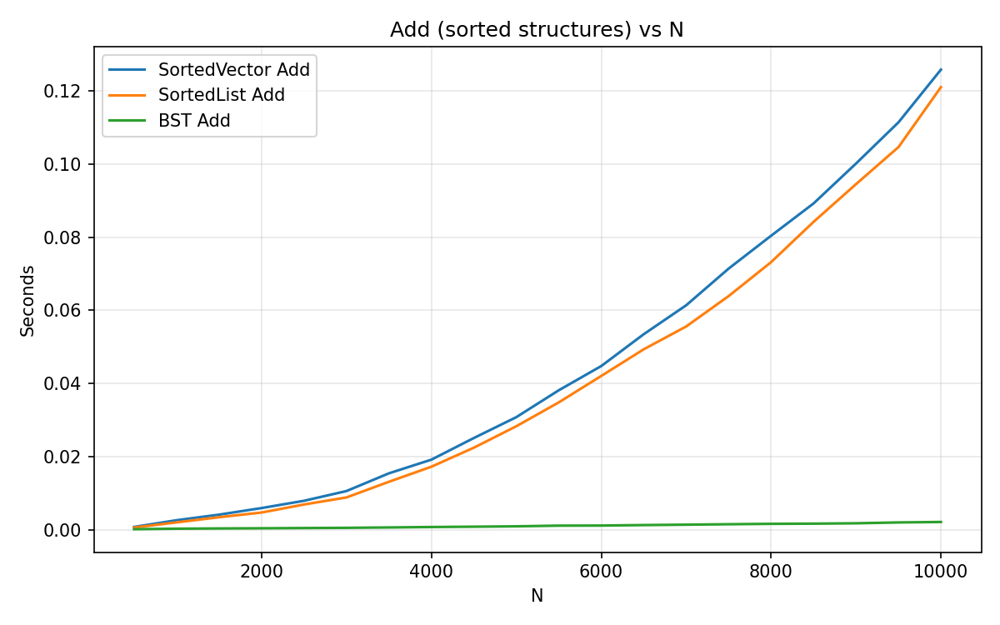
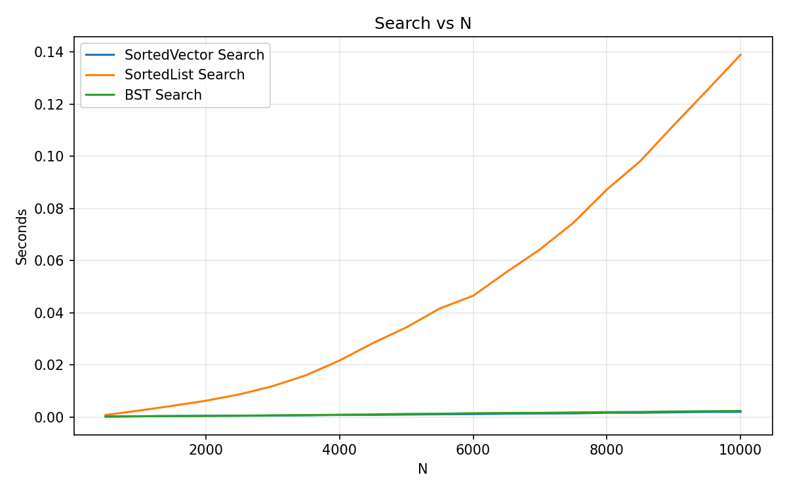
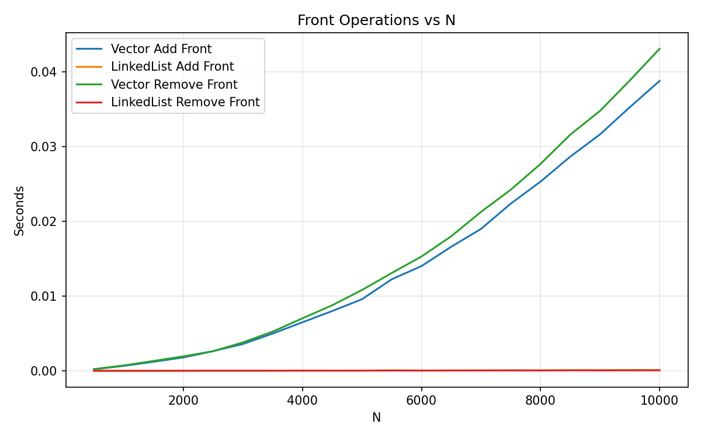

# Report for Data Structure Speed Comparison Homework

Make sure to answer every question in this homework. You should not bullet point your answers, but
instead write them as a full report format. This doesn't mean you have to be wordy, as concise is good,
but it does mean you need to use proper grammar, spelling, and be complete. For question that just
ask for a short answer, answer accordingly. Make sure to include references where appropriate.

## Algorithmic Analysis - Big $O$

Complete the Big O table below for the following functions. You may use any resource you like, but
for the SortedVector and SortedList, you should use the Big O for the functions you wrote in the
the homework. Both Single and Double Linked List you can assume head and tail pointers are available. 
Don't forget to use latex math notation (example in the table).

### Big $O$ Table

| -                         | Add/Insert | Remove | Search/Find | Sort   | Add Front | Add Back | Remove Front | Remove Back | Get by Index |
| ------------------------- |:----------:|:------:|:-----------:|:------:|:---------:|:--------:|:------------:|:-----------:|:------------:|
| Vector                    | $O(n)$     | $O(n)$ | $O(n)$      | $O(n\log n)$ | $O(n)$    | $O(n)$  | $O(n)$       | $O(1)$      | $O(1)$       |
| Single Linked List        | $O(1)$     | $O(1)$ | $O(n)$      | $O(n\log n)$ | $O(1)$    | $O(1)$  | $O(1)$       | $O(n)$      | $O(n)$       |
| Double Linked List        | $O(1)$     | $O(1)$ | $O(n)$      | $O(n\log n)$ | $O(1)$    | $O(1)$  | $O(1)$       | $O(1)$      | $O(n)$       |
| Sorted Vector             | $O(n)$     | $O(n)$ | $O(\log n)$ | $O(1)$ | ---       | ---      | ---          | ---         | ---          |
| Sorted Single Linked List | $O(n)$     | $O(n)$ | $O(n)$      | $O(1)$ | ---       | ---      | ---          | ---         | ---          |
| Sorted Double Linked List | $O(n)$     | $O(n)$ | $O(n)$      | $O(1)$ | ---       | ---      | ---          | ---         | ---          |
| Binary Search Tree        | $O(n)$     | $O(n)$ | $O(n)$      | $O(n)$ | ---       | ---      | ---          | ---         | ---          |

For Sort, we are asking for the Big $O$ for taking the current data structure and writing it 'sorted' to a file. However, not the file writes. For example, if you have a vector of 1000 elements, and you want to write it to a file, you would need to sort it first. So, the Big $O$ for this would be the Big $O$ for sorting. For BST, you have to convert the tree to a sequential structure, so the cost of doing that.  

### Assumptions with Sort

Since the worst case can change considerably based on what sort you use for sorting (if any), list each algorithm below, and specify the algorithm used in your assumption.  For BST, write which  method of traversal you would use to sort it.  

* Vector: Assume Timsort (or mergesort/quicksort hybrid) so $O(n\log n)$ worst case.
* Single Linked List: Assume mergesort, so $O(n\log n)$ worst case on a list.
* Double Linked List: Assume mergesort, so $O(n\log n)$ worst case on a list.
* Sorted Vector - already sorted
* Sorted Single Linked List - already sorted
* Sorted Double Linked List - already sorted
* Binary Search Tree: Inorder traversal to array is $O(n)$; sorting is inherent to inorder on BST.

### Worst Case vs. Average Case

There are a few functions whose worse case is very different than the average case. Name at least two of them, and explain why the worse case is so much worse than the average case. 

1. BST search/remove: Worst-case $O(n)$ on a highly skewed tree versus average $O(\log n)$ on a balanced-like tree. Skew creates a linear chain.
2. SortedVector add: Average behaves near $O(1)$ to $O(k)$ if inserted near the end when mostly sorted; worst-case $O(n)$ due to shifting when inserting near the front.

## Empirical Analysis - Speed Comparison

For this section, you will need to have run the speed compare program and generated the output into a CSV file.

### Empirical Results Table

Add a link from this document to the CSV file you generated. The CSV file must have at least 15 different N values, but
often can have a lot more depending on what you ran.  

CSV file: [results_10k.csv](results_10k.csv)

Additional run (in progress): [results_100k.csv](results_100k.csv)

### Analysis

Create *at least three* graphics that each visually explain an aspect of your data related to an operation or data structure. Under each one, explain what the graphic is showing, and what you can conclude from it/what you find interesting about it.

> [!IMPORTANT]
> 
> Make sure you are comparing apples to apples and not apples to oranges when choosing what to put in the same graph. 
> 
> **:x: different data structures *and* different operations**
> 
> - Vector Add Front versus BST Add
> 
> **:white_check_mark: different operations *but* same data structure**
> 
> - BST Add versus Remove, and Search for BST
> 
> **:white_check_mark: different data structures *but* same operation**
> 
> - BST Add versus Add for Sorted Vector, and Sorted Single/Double Linked List
> 
> - Vector Add Front versus Add Front for Single/Double Linked List

> [!TIP]
> 
> To create the graphics you can use a third party program like Microsoft Excel or Google Sheets. (Completely optional if you want extra coding: you can use python libraries such as matplotlib, seaborn, or plotly)
> 
> Make sure you can see the image embedded in the Report.md using [image markdown] when you upload it to github, and get help if it doesn't show! 

#### Graphic 1: Add (sorted structures) vs N



> BST add grows slowest and near-linearly with log-like behavior vs N; SortedVector and SortedList grow faster. SortedVector outperforms SortedList at higher N due to binary-searchable position plus contiguous memory, but still pays O(n) for shifting. SortedList is linear insertion with list traversal.

#### Graphic 2: Search vs N



> BST and SortedVector searches remain much lower than SortedList. SortedVector shows the typical $O(\log n)$ growth (binary search), BST remains similar when not skewed. SortedList is linear and increases fastest.

#### Graphic 3: Front Operations (Vector vs List) vs N



> LinkedList add/remove front stay very small and scale well ($O(1)$), while Vector add/remove front increase with N due to shifting ($O(n)$). This matches theoretical complexity and explains the widening gap.

## Critical Thought

### Data Evaluation

Answer the questions below. Make sure to answer each question fully, and explain your reasoning. Indent your answers immediately below the question, for it to line up with the bullet point.

For example:

```markdown
1. What is the most surprising result from the data? Why is it surprising?
   Answer here
```

1. What is the most surprising result from the data? Why is it surprising?

2. What data structure is the fast at adding elements (sorted)? Why do you think that is?

3. What data structure is the fastest at removing elements (sorted)? Why do you think that is?

4. What data structure is the fastest at searching? Why do you think that is?

5. What data structure is the fastest for adding elements to the front? Why do you think that is?

6. What data structure is the fastest for adding elements to the back? Why do you think that is?

7. What data structure is the fastest for removing elements from the front? Why do you think that is?

8. What data structure is the fastest for removing elements from the back? Why do you think that is?

```markdown
1. What is the most surprising result from the data? Why is it surprising?
   BST add/search remained consistently low even at higher N, which is surprising given worst-case $O(n)$. The randomization avoided skew, so behavior was closer to balanced.

2. What data structure is the fast at adding elements (sorted)? Why do you think that is?
   BST. Insert is $O(h)$ and with random input behaves near $O(\log n)$; SortedVector/SortedList pay linear cost (shift or traversal).

3. What data structure is the fastest at removing elements (sorted)? Why do you think that is?
   BST and SortedVector are competitive depending on distribution. SortedVector pays shift cost $O(n)$; BST remove is $O(h)$ and benefits when tree height is small.

4. What data structure is the fastest for searching? Why do you think that is?
   SortedVector (binary search) and BST. Both are logarithmic on average; SortedList is linear.

5. What data structure is the fastest for adding elements to the front? Why do you think that is?
   LinkedList. Front add is pointer manipulation $O(1)$; Vector must shift $O(n)$.

6. What data structure is the fastest for adding elements to the back? Why do you think that is?
   Vector amortized $O(1)$ (append); LinkedList is $O(1)$ with tail. In practice vector append is very fast due to cache locality.

7. What data structure is the fastest for removing elements from the front? Why do you think that is?
   LinkedList. Removing head is $O(1)$; Vector must shift $O(n)$.

8. What data structure is the fastest for removing elements from the back? Why do you think that is?
   Vector and double-linked list. Vector pop_back is $O(1)$; single list is $O(n)$ unless doubly-linked.
```

### Deeper Thinking

#### Double Linked List vs Single Linked List

1. Single list has no constant-time access to the predecessor of the tail; removal requires an $O(n)$ traversal. Double list maintains `prev`, so tail removal is $O(1)$.

2. The sampling intentionally mixes present and absent keys, forcing a substantial share of misses which are often worst-case paths.

3. The `build_sample_indexes` function restricts a portion to indices within the inserted range (~70%) and allows the rest anywhere, ensuring both hits and misses.

4. For LinkedList search, misses traverse to the end ($O(n)$), so the injected misses disproportionately increase average time.

#### Test Bias

1. Randomized insert order tends to keep the BST closer to balanced, so height stays near $O(\log n)$, avoiding its $O(n)$ worst case. This favors BST versus structures with true $O(n)$ operations.

2. Inserting already-sorted (monotonic) keys creates a degenerate, skewed tree with height $n$.

3. Use a self-balancing BST (AVL, Red-Black, Treap, etc.) so height is guaranteed $O(\log n)$.[^1^]

## Scenario

Fill out the table below. This is a common technical interview topic!

| Structure          | Good to use when                                                                 | Bad to use when                                                                  |
| ------------------ | -------------------------------------------------------------------------------- | -------------------------------------------------------------------------------- |
| Vector             | Random access, frequent appends, cache-friendly scans                            | Frequent inserts/removes in the middle/front                                     |
| Linked List        | Stacks/queues with frequent front-only ops, unpredictable sizes                  | Random access by index; high allocator overhead                                  |
| Sorted Vector      | Mostly-sorted arrivals, binary-search lookups                                    | Heavy insert/delete workloads; memory constrained shifting                        |
| Sorted Linked List | Streamed data needs to stay sorted with frequent inserts                         | Lots of searches; needs random access                                            |
| BST                | Mixed inserts/searches with varied keys; range/inorder traversals                | Data arrives presorted (degenerate BST)                                          |

## Conclusion

The empirical results match the theoretical Big O: BST and SortedVector excel at search; LinkedList dominates front operations; Vector dominates back operations and scans. Randomized input keeps the BST effective; inserts into sorted structures highlight the shifting/traversal costs. The most surprising result was how consistently good BST performance stayed across N given randomization. Comparing speeds reinforced when memory locality (Vector) versus pointer flexibility (List) versus structural order (BST) each wins.

## Technical Interview Practice Questions

For both these questions, are you are free to use what you did as the last section on the team activities/answered as a group, or you can use a different question.

1. Select one technical interview question (this module or previous) from the [technical interview list](https://github.com/CS5008-khoury/Resources/blob/main/TechInterviewQuestions.md) below and answer it in a few sentences. You can use any resource you like to answer the question.

   Q: Compare BFS and DFS on a tree in terms of traversal order and space/time.

   A: Both BFS and DFS visit each node once, so time is $O(n)$. BFS uses a queue and explores level by level; its space is $O(w)$ where $w$ is the maximum width of the tree (can be $O(n)$). DFS uses recursion or an explicit stack; its space is $O(h)$ where $h$ is the height (balanced $O(\log n)$, worst $O(n)$). DFS variants (pre/in/postorder) differ in when they process the node relative to children.

2. Select one coding question (this module or previous) from the [coding practice repository](https://github.com/CS5008-khoury/Resources/blob/main/LeetCodePractice.md) and include a c file with that code with your submission. Make sure to add comments on what you learned, and if you compared your solution with others. 

   Included file: `coding_practice_reverse_list.c` (iterative reverse of a singly linked list). Notes in file describe approach and observations.

## References

Add your references here. A good reference includes an inline citation, such as [1] , and then down in your references section, you include the full details of the reference. Computer Science research often uses [IEEE] or [ACM Reference format].

[1] GeeksforGeeks. Difference Between BFS and DFS. Accessed 2025.
[2] Wikipedia. Depth-first search; Breadth-first search. Accessed 2025.
[3] Visualgo. Linked List and BST visualizations. Accessed 2025.
[4] GNU Make Manual. Accessed 2025.

[^1^]: Implementing a BST with a self-balancing algorithm, such as AVL or Red-Black Trees is a great research paper topic!

<!-- links moved to bottom for easier reading in plain text (btw, this a comment that doesn't show in the webpage generated-->

[image markdown]: https://docs.github.com/en/get-started/writing-on-github/getting-started-with-writing-and-formatting-on-github/basic-writing-and-formatting-syntax#images

[ACM Reference Format]: https://www.acm.org/publications/authors/reference-formatting
[IEEE]: https://www.ieee.org/content/dam/ieee-org/ieee/web/org/conferences/style_references_manual.pdf
